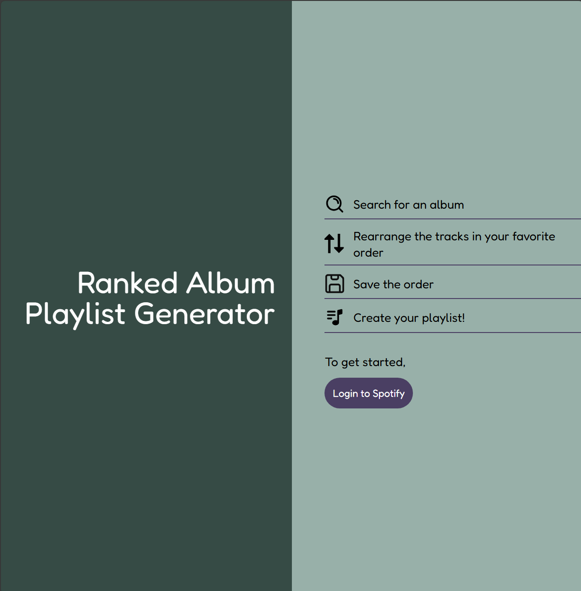
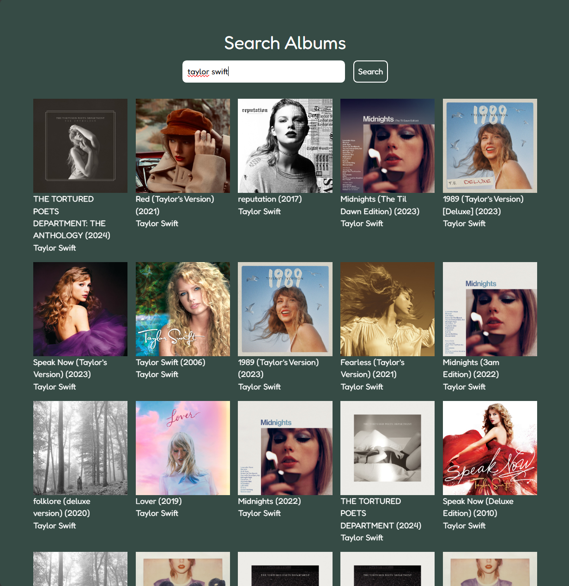
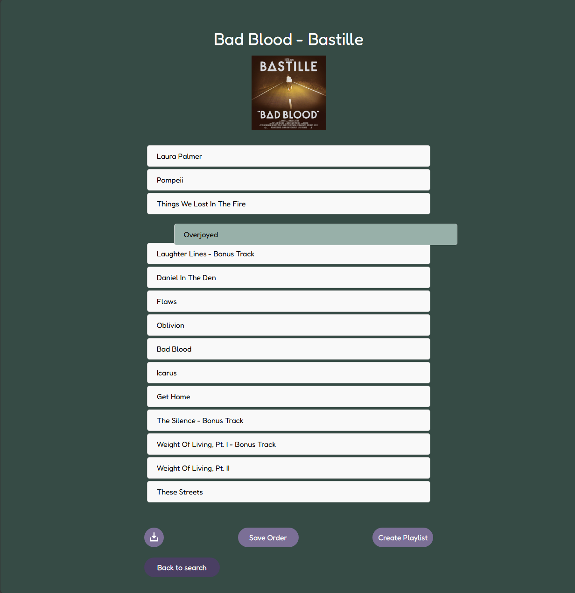

# 🎵 Album Track Ranking Web App

This web app allows users to select an album, view its tracks, rearrange the order using drag-and-drop, and create a custom Spotify playlist based on their preferred track ranking. It’s built using React, Next.js, and Spotify’s Web API.

## 🚀 Features

- **Spotify Integration:** Authenticate with your Spotify account to view albums and create custom playlists.
- **Drag-and-Drop Track Reordering:** Easily rearrange the order of tracks from any album.
- **Custom Playlist Creation:** Save your reordered tracks into a new Spotify playlist directly from the app.
- **Download Track Order as an Image:** Download a snapshot of your ordered track list as a `.png` file.

## 🛠️ Built With

- **Frontend:** React, Next.js (includes API routes for backend), Tailwind CSS
- **API Integration:** Spotify Web API
- **Deployment:** Vercel ([Live Demo](https://album-ranking-playlist.vercel.app))

## 🖼️ Screenshots

| Main Interface | Drag-and-Drop Reordering | Custom Playlist Creation |
|:--------------:|:-----------------------:|:------------------------:|
|  |  |  |
