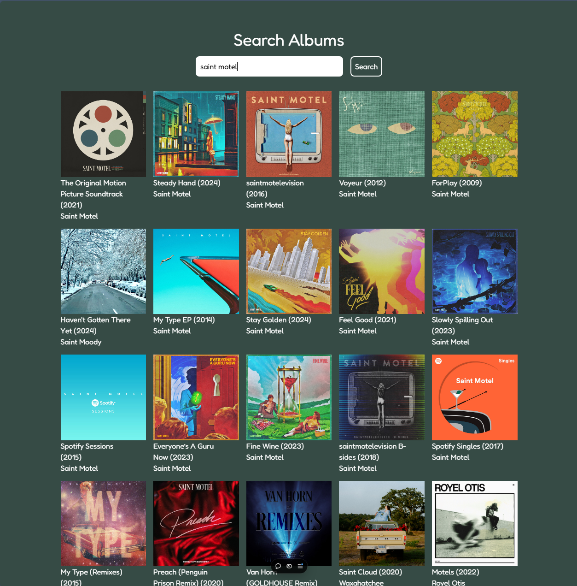

# 🎵 Album Track Ranking Web App

This web app allows users to select an album, view its tracks, rearrange the order using drag-and-drop, and create a custom Spotify playlist based on their preferred track ranking. It’s built using React, Next.js, and Spotify’s Web API.

## 🚀 Features

- **Drag-and-Drop Track Reordering:** Easily rearrange the order of tracks from any album.
- **Spotify Integration:** Authenticate with your Spotify account to view albums and create custom playlists.
- **Custom Playlist Creation:** Save your reordered tracks into a new Spotify playlist directly from the app.
- **Download Track Order as an Image:** Download a snapshot of your ordered track list as a `.png` file.

## 🛠️ Built With

- **Frontend:** React, Next.js, Tailwind CSS
- **Backend:** Node.js, Express
- **API Integration:** Spotify Web API
- **Deployment:** Vercel (Frontend), Localhost for Backend

## 🖼️ Screenshots

| Main Interface | Drag-and-Drop Reordering | Custom Playlist Creation |
|:--------------:|:-----------------------:|:------------------------:|
|  |  |  |

## 🧑‍💻 Getting Started

### Prerequisites

- Node.js (>= 16.0.0)
- A [Spotify Developer Account](https://developer.spotify.com/dashboard/) and a registered application to obtain client credentials.

### Installation

1. Clone the repository:

    ```bash
    git clone https://github.com/your-username/album-track-ranking.git
    ```

2. Navigate to the project directory:

    ```bash
    cd album-track-ranking
    ```

3. Install dependencies for both frontend and backend:

    ```bash
    npm install
    cd client && npm install
    ```

4. Create an `.env` file in the root directory and add your Spotify client credentials:

    ```bash
    SPOTIFY_CLIENT_ID=your_spotify_client_id
    SPOTIFY_CLIENT_SECRET=your_spotify_client_secret
    ```

### Running the App Locally

1. **Start the backend server:**

    In the root directory, run:

    ```bash
    npm run server
    ```

    This will start your backend on `http://localhost:3001`.

2. **Start the frontend:**

    In the `client` directory, run:

    ```bash
    npm run dev
    ```

    This will start your frontend on `http://localhost:3000`.

3. **Access the app:** Open `http://localhost:3000` in your browser.

### Folder Structure

